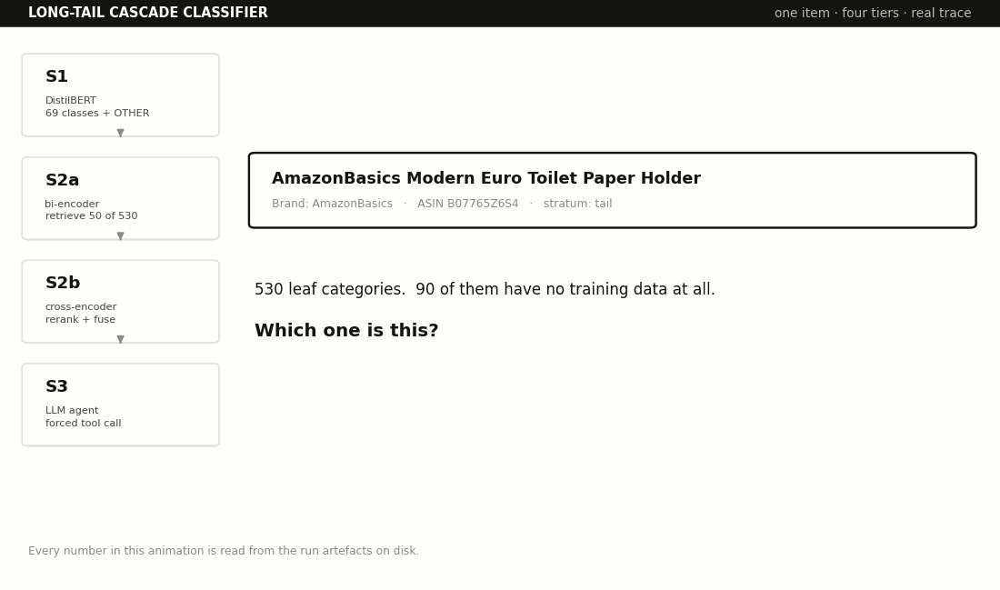

# Long-Tail Cascade Classifier

[](https://github.com/Jaydenlee4891/Product-Classifer/actions/workflows/tests.yml)

A four-tier classifier for taxonomies where most labels are rare and some have no training
data at all. Each tier answers what it can and defers the rest, so cost and capability rise
only for the items that need them.

**Result on 12,200 held-out items across 530 leaves: micro 0.895, macro 0.647.**
A TF-IDF + LinearSVC baseline on the same items scores micro 0.919, macro 0.507 — the
cascade wins macro by **+0.140** and loses micro by 0.024. Where that trade comes from is
the whole story, and it is in [Results](#results).

Every number in this README comes from a run whose artefacts are on disk. Where a decision
was made, the measurement that settled it is given next to it.

---

## The problem

Real taxonomies are Zipfian. In Amazon Berkeley Objects, one leaf is 53.5% of the corpus
and 245 leaves have fewer than ten items in it. Two consequences shape everything here:

**Accuracy is meaningless.** Predicting `CELLULAR_PHONE_CASE` for everything scores 53%
micro. Every metric below is reported micro (per item) *and* macro (per leaf), and **macro
is the one to read** — micro is close to a report on that single class.

**A softmax classifier cannot represent a label it never saw.** Not "does badly on" —
cannot represent. A flat classifier's score on genuinely unseen leaves is 0.000 by
construction, and no amount of training data for other classes changes that.

The cascade exists for the second point. Everything else is engineering around it.

---

## Architecture



*ASIN B07765Z6S4, a tail-stratum item, traced through the real pipeline. Note S1's output:
`__OTHER__` at p_max **0.9987** — it defers while 99.87% confident, because the gate is
`argmax == OTHER OR p_max < τ`, not a threshold alone. Rebuild with
`python docs/portfolio/make_gif.py`.*

```
item ──▶ S1  DistilBERT over 69 head classes + OTHER
         │   answers 83.5% of items at 0.977 accuracy
         │   defers when  argmax == OTHER  OR  p_max < 0.900
         ▼
        S2  frozen Qwen3-Embedding-0.6B retrieves top-50 label documents
         │   fine-tuned MiniLM cross-encoder rescores them
         │   the two orderings are INTERLEAVED into a 10-candidate shortlist
         ▼
        S3  an LLM reads the shortlist and picks one leaf, or abstains
```

S2 never emits a final label in the shipped configuration. Its entire contribution is the
shortlist it hands to S3 — it is a candidate generator, not a classifier.

---

## Data

ABO listings metadata, audited rather than trusted:

| | raw | after filtering |
|---|---|---|
| Records | 147,702 | **121,133** |
| Leaves (`product_type`) | 576 | **530** |
| English `item_name` | 83.1% | 100% |
| Largest leaf | `CELLULAR_PHONE_CASE`, 53.5% | 53.5% of train, 53.1% of test |

Splits are **80/10/10 stratified per leaf**, seed 17 — train 96,857 / val 12,076 /
test 12,200. Leaves with fewer than three items send one item to test and keep the rest in
train, so **every leaf lands at least one test row**. Without that floor the rare strata
would be computed from nothing.

### Frequency strata

Assigned by post-holdout training frequency. The thresholds are a convention chosen in
advance; the distribution is ABO's.

| stratum | rule | leaves | actual train counts |
|---|---|---|---|
| head | ≥ 1000 | 7 | 1,149 – 51,808 |
| torso | 100 – 999 | 62 | 100 – 970 |
| tail | 10 – 99 | 182 | 10 – 97 |
| few_shot | 1 – 9 | 189 | 1 – 9 |
| zero_shot | 0 | 90 | 0 |

**Every boundary falls in an empty gap.** Nothing exists between 971 and 1,148, or between
98 and 99. The cuts can move within those gaps without a single leaf changing stratum, so
the strata are not an artifact of where the knife went.

### Two things the data forced

**Node paths carry no language tag.** All 169,347 `node` entries lack the `language_tag`
key that ABO's other localised fields use. About 30% of paths are Spanish, German, Japanese,
French, Dutch, Swedish or Turkish (`/Categorías`, `/カテゴリー別`, `/Kategorien`, …), and the
non-English ones are frequently the longest. Selecting the longest path would have silently
mixed languages into the label documents. `prepare.py` whitelists English roots instead.

**The zero-shot stratum is constructed, not found.** Every `product_type` in ABO has at
least one item, so no true zero-shot stratum exists. `prepare.py` deletes every *training*
row for 30 leaves while keeping their val/test rows and their label documents; 60 more
leaves arrive naturally as singletons whose only item went to test. 90 total — unreachable
by any supervised classifier, reachable only through label text.

### Label noise, measured

121,133 rows hold only 120,417 unique `item_id`s: **716 duplicates, 216 exact repeats, 56
filed under two different leaves.** No leakage — split assignment is keyed on `item_id`, so
all rows sharing an id land in the same split (verified: 0 ids span more than one split).

The taxonomy also contradicts itself. Gold `EYEWEAR` on an item whose own ABO path ends in
*Sunglasses*; `WASHER_DRYER_COMBINATION` and `LAUNDRY_APPLIANCE` on an identical path. Some
fraction of the remaining error is unwinnable, which bounds the ceiling below 1.0.

Deduping would mean re-splitting, invalidating every measurement, to move 0.6% of rows.
Known and left alone.

---

## Design decisions

Each was settled by a run, not a preference.

| Decision | Value | Evidence |
|---|---|---|
| S1 model | DistilBERT, max_len 128, batch 32, lr 3e-5, 3 epochs | fits a 6GB card; fp16 + GradScaler (no bf16 below CC 8.0) |
| S1 label space | 69 head classes + `OTHER` | cut at ≥100 train items — every such class works, F1 collapses below 30 |
| S1 deferral | `argmax == OTHER` **or** `p_max < 0.900` | τ fitted on **val** at a 98% precision target |
| S1 operating point | 83.5% answered, 0.977 accuracy, deferral recall 0.849 | on **test**, at the τ val chose |
| Class weighting | **none** | `sqrt` gives +0.005 macro-F1 and loses every cascade metric |
| Retriever | Qwen3-Embedding-0.6B, **frozen** | macro recall@50 = 0.977 with no fine-tuning |
| Retrieval depth | K = 50 | macro@50 0.977 vs macro@20 0.946 — widening is free |
| Label document | `v3_proto` = name + ancestor path + prototype titles | macro@50 0.977 vs 0.945 for path alone; prototypes drawn from train only |
| Reranker | ms-marco-MiniLM-L-6-v2, 2 epochs, listwise, 200/leaf cap, group 8, max_len 192 | hard negatives mined from the retriever's own top-50 |
| Shortlist | **fused**, m = 10 | macro recall@10 — fused 0.931, bi 0.919, cross 0.760 |
| S3 | forced `record_category` tool call, categorical confidence, shuffled candidates, 2-shot including an abstention | 0 hallucinated leaf ids in 2,015 answers |

### Why τ is fitted on val

An earlier version computed the threshold table over val and test pooled and reported on the
same pool — selecting a threshold using the set it is then reported on. Refitting on val
alone moves τ from 0.925 to 0.900, and test lands at 0.977 against the 0.980 val met.
**Selection optimism: 0.003 accuracy, 0.017 deferral recall.** Small, but the procedure was
wrong and the fix is free — `stage1.py --from-probs` re-reports a finished run from saved
probabilities without retraining.

### Why the shortlist is fused

The fine-tuned cross-encoder **fails its own gate**. Macro recall@10 is 0.760 against the
frozen retriever's 0.919; on zero-shot it reaches 0.124, below the 0.200 you would get by
shuffling its 50 candidates at random. Its gate says drop the tier.

But it is sharply right where it has data, and interleaving the two orderings keeps both:

| stratum | bi | cross | fused |
|---|---|---|---|
| head | 0.740 | 0.887 | **0.877** |
| torso | 0.884 | 0.962 | **0.958** |
| tail | 0.920 | 0.931 | **0.937** |
| few_shot | 0.958 | 0.825 | **0.952** |
| zero_shot | 0.876 | **0.124** | **0.860** |
| **ALL** | 0.919 | 0.760 | **0.931** |

Fusing costs 0.006 on few_shot and 0.016 on zero_shot and buys 0.137 on head and 0.074 on
torso. The cross-encoder is not a shortlist producer; it is a complement to a retriever that
never learned which labels are rare.

### Three label-document renderings, not one

Each tier reads label documents in the exact form the run that measured it used: retrieval
the full untruncated document, the reranker the variant recorded in **its own checkpoint's**
`run_config.json`, the agent its own prompt rendering. Collapsing them silently swaps a
measured tier for an unmeasured one. `pipeline.py` reads the reranker's variant and
`max_len` from the checkpoint rather than assuming them.

---

## Results

### End to end — 12,200 test items, 530 leaves

| stratum | n | leaves | micro | macro |
|---|---|---|---|---|
| head | 8,792 | 7 | 0.951 | 0.805 |
| torso | 2,355 | 62 | 0.817 | 0.794 |
| tail | 620 | 182 | 0.674 | 0.662 |
| few_shot | 189 | 189 | 0.693 | 0.693 |
| zero_shot | 244 | 90 | 0.357 | 0.407 |
| **ALL** | **12,200** | **530** | **0.895** | **0.647** |

### Stage attribution — who decided, and were they right

```
      stage   share   micro   macro
         S1   83.5%   0.977   0.394
         S3   15.3%   0.522   0.715
 S3-abstain    1.3%   0.000   0.000
```

Read the share and the accuracy together. **S1 answers 83.5% of items at 0.977 accuracy and
0.394 macro** — a per-item winner and a per-leaf loser, because the rare items it wrongly
keeps are spread across many leaves that each score zero. S3 is the mirror image. That gap
is the entire case for the cascade in one line: a system reporting only micro would show
97.7% at the first tier and nobody would build the rest.

### Against the baseline, same 12,200 items

| stratum | TF-IDF micro | cascade | TF-IDF macro | cascade | Δ macro |
|---|---|---|---|---|---|
| head | **0.981** | 0.951 | **0.917** | 0.805 | −0.112 |
| torso | **0.874** | 0.817 | **0.849** | 0.794 | −0.055 |
| tail | **0.721** | 0.674 | **0.696** | 0.662 | −0.034 |
| few_shot | 0.439 | **0.693** | 0.439 | **0.693** | **+0.254** |
| zero_shot | 0.000 | **0.357** | 0.000 | **0.407** | **+0.407** |
| **ALL** | **0.919** | 0.895 | 0.507 | **0.647** | **+0.140** |

**A four-tier system with a 600M retriever, a fine-tuned reranker and an LLM loses to word
and character n-grams in a linear SVM on head, torso *and* tail.** The entire macro win is
few_shot and zero_shot.

Zero-shot is not a close contest but a categorical one: TF-IDF scores exactly 0.000 and
cannot do otherwise. The cascade reaches 0.407 because retrieval matches against label
*text*. That is not "better at the tail" — it is *defined at all* in a regime where the
baseline is not.

**The design finding this forces.** S1's head cut was set at ≥100 training items from
DistilBERT's per-class F1 knee. That knee is a property of DistilBERT, not of supervised
learning: TF-IDF still reaches 0.696 macro on leaves with 10–99 examples, where the cascade
— which defers all of them — gets 0.662. **The cut was calibrated to the wrong model.** The
system this evidence argues for is a cheap supervised tier over all 440 trainable leaves,
with retrieval and the agent reserved for the 90 leaves that genuinely have no training data.

### Conformal prediction sets — calibrated exactly, and useless where it matters

`stage2_conformal.py` replaces the hand-tuned threshold with a distribution-free guarantee.
Nonconformity `s(x,y) = 1 - p(y|x)` over the 50 candidates, threshold at the
`⌈(n+1)(1-α)⌉/n` empirical quantile of the **validation** scores, prediction set
`C(x) = { y : p(y|x) ≥ 1-q }`. Routing: `|C|=1` accept, `|C|>1` escalate with exactly those
candidates, `|C|=0` escalate the full top-50 as out-of-distribution.

The calibration is essentially exact — conditional coverage against nominal:

```
  α = 0.10   0.894 / 0.900     α = 0.05   0.943 / 0.950     α = 0.01   0.987 / 0.990
```

All within 0.007. Now look at where that average comes from (α = 0.10):

```
   stratum  cov_given_retr  median_set  accept_rate
      head           0.923        1.00        0.852
     torso           0.907        1.00        0.633
      tail           0.860        1.00        0.571
  few_shot           0.652        1.00        0.529
 zero_shot           0.017        2.00        0.287
       ALL           0.894        1.00        0.779
```

**Marginal coverage 0.894; zero-shot coverage 0.017.** The guarantee is honoured exactly as
advertised and is worthless on the stratum the architecture exists for. At α = 0.01
zero-shot reaches only 0.477, with a median set of **27.5 of 50 candidates** — not a
prediction set, a shrug.

This is the textbook gap between *marginal* and *conditional* coverage, on real data, and it
is finding 1 arriving from a fourth direction: the nonconformity scores come from the
fine-tuned reranker, so the calibrated threshold inherits its blindness to rare leaves.

`--mondrian predicted` groups the threshold by the **predicted** leaf's stratum — predicted,
because conditioning on the true stratum would require knowing the answer being sought. It
helps a little (zero-shot 0.017 → 0.105 at α = 0.10) and the script says honestly why it
cannot help more: only **3 calibration points** fall in the zero-shot group, against the ≥9
needed for the guarantee to bind.

Two further notes the script reports rather than hides: the guarantee is **conditional on
retrieval** — an item whose gold leaf was never in the top-50 cannot be covered at any α, so
end-to-end coverage is `P(retrieved) × P(covered | retrieved) = 0.971 × 0.894 = 0.869`. And
escalation at α = 0.10 is 22.1% of items, against the 5% the original design assumed.

### Stage 3, paired against its own shortlist's top candidate

McNemar exact, two-sided, on all 2,015 escalated items:

```
   stratum     n  agent   top1     net  a>t  t>a        p
      head   408  0.034  0.076  -0.042    7   24   0.0033 **
     torso   708  0.455  0.304  +0.151  148   41   0.0000 ***
      tail   581  0.719  0.670  +0.050   72   43   0.0087 **
  few_shot   169  0.775  0.734  +0.041   21   14   0.3105
 zero_shot   149  0.584  0.430  +0.154   39   16   0.0027 **
       ALL  2015  0.482  0.408  +0.074  287  138   0.0000 ***
```

The shortlist contains the gold leaf 90.6% of the time. On head the agent is significantly
*worse* than its own shortlist's top candidate — the only negative sign in the table.

---

## Findings

### 1. Anything trained on the observed label distribution suppresses the unobserved tail

Four independent demonstrations in one system:

- `OTHER` catches 79% of tail and 73% of few-shot items but only **31%** of zero-shot.
- The fine-tuned reranker drops zero-shot to macro recall@10 = **0.124**.
- `sqrt` class weighting improved head/torso deferral and made tail deferral **worse**
  (0.796 → 0.696).
- Conformal prediction calibrates to within 0.007 of nominal and still delivers **0.017**
  coverage on zero-shot, because its nonconformity scores come from the reranker.

The mechanism for `OTHER` is exact: it was trained on **6,397 rows — 5,793 tail, 604
few-shot, 0 zero-shot.** It is a learned class whose training set *is* the tail. It
recognises unseen items of seen tail leaves. It cannot recognise an unseen leaf.

**Consequence:** the frozen retriever is load-bearing precisely *because* it never learned
the label distribution. Freezing it was not a concession to a 6GB card.

### 2. The cross-encoder's problem is mostly capacity, not fine-tuning

The off-the-shelf checkpoint — never trained on ABO — already loses everywhere (macro
recall@10, 4k subsample: 0.728 vs the retriever's 0.915). `ms-marco-MiniLM-L-6-v2` is 22.7M
parameters trained on web passage ranking, against a ~595M instruction-tuned retriever.
Joint attention does not cover a 26× gap.

Fine-tuning then *steepens an existing tilt*. Mean position of a candidate in the 50-item
list, by its leaf's training frequency:

```
                 zs   1-10   -100    -1k    >1k     span
bi (control)   27.3   28.0   25.4   21.8   15.1     12.2
off-shelf CE   32.4   24.8   20.9   19.5   17.9     14.5
fine-tuned CE  40.0   28.4   17.6    8.8    3.3     36.7
```

Every scorer mildly prefers common leaves — partly because common leaves are common
*because* they are broad, so their label documents match more text. Fine-tuning turns a
14.5-position tilt into a 36.7-position one.

### 3. τ cannot do tail work — it is structurally the wrong instrument

Who defers what, at τ = 0.90:

```
   stratum      n  by OTHER   by tau    kept | gold in S1's label space
      head  17557      0.9%     4.0%   95.1% |      100.0%
     torso   4718      4.0%    25.3%   70.7% |      100.0%
      tail   1242     79.1%    15.4%    5.6% |        0.0%
  few_shot    334     72.8%    18.0%    9.3% |        0.0%
 zero_shot    425     31.1%    28.2%   40.7% |        0.0%
```

τ's largest contribution is **torso**. And where it is most needed it is actively fooled —
when S1 is wrong and does not say `OTHER`, zero-shot errors carry the *highest* confidence
(mean p_max 0.845; 59% above 0.9; 9% above 0.99, against head's 0.742 / 24.7% / 1.7%).

Max-softmax measures how peaked the distribution is over the 69 classes S1 knows. It does
not measure whether the true answer is among them. **`OTHER` is the tail router, τ is the
torso trimmer, and nothing in S1 is a novel-leaf detector.**

### 4. Macro-F1 chose the wrong model

`sqrt` class weighting scores +0.005 macro-F1 (0.830 → 0.835) and loses every cascade metric
at the operating point — fewer items answered, lower accuracy, lower deferral recall, all at
once. The metric that describes a *classifier* is not the metric that describes a
classifier's *role in a cascade*, and you only see the difference if you measure the role.
`head69_sqrt` is kept on disk as the evidence.

### 5. A 26-item table said the opposite of the truth

An early Stage 3 run on 300 items showed zero-shot at −0.106 against the shortlist's top
candidate. It was written up as a regression, a mechanism was proposed, and a $0.40 ablation
was run to fix it. The same measurement at two sample sizes:

```
  n= 26 : -0.106   discordant  3 vs  6   p=0.508
  n=149 : +0.154   discordant 39 vs 16   p=0.0027
```

Same system, same configuration, **opposite conclusion** — and the original rested on three
items. Macro averaging hid it: with 18 leaves inside 26 items, one item moving shifts macro
by 0.04. The failure was not the small sample; it was reporting a per-stratum table without
its discordant counts beside it. The ablation is retained as a documented null result
(p=0.804, 16 of 300 items changed).

---

## Repository

```
src/prepare.py           ABO → items.parquet, splits, strata, zero-shot construction
src/label_docs.py        4 cumulative label-document variants; --describe adds descriptions
src/recall.py            retrieval gate — recall@k per variant per stratum
src/baselines.py         majority + TF-IDF/SGD or LinearSVC floor
src/stage1.py            S1 training, deferral table, funnel; --from-probs re-reports free
src/stage2_rerank.py     negative mining, listwise training, recall@m gate
src/stage2_conformal.py  split conformal prediction sets + set-size routing
src/stage3_agent.py      Batch API agent tier, ablations, --dry-run
src/shortlist.py         the one shortlist implementation, shared by both callers
src/pipeline.py          Cascade object + end-to-end evaluation with stage attribution
src/test_pipeline.py     21 assertions, no model required
src/check_docs.py        fails the build when the README stops describing the code
src/sweep.py             tau frontier replayed from cached Stage 3 answers — costs nothing
src/provenance.py        which device and precision produced each array in data/
src/serve/graph.py       the cascade as a LangGraph state graph over the same Cascade object
src/serve/llm.py         Stage 3 as a swappable node: anthropic | raw | cached | ollama | none
src/serve/agent.py       second pass: a bounded agent loop that can search the taxonomy
src/serve/app.py         FastAPI endpoint, weights loaded once at startup
src/serve/verify.py      served path vs the offline arrays
src/serve/bench.py       per-tier latency, cold start excluded and reported separately
src/serve/diagnose_embedding.py   padding, batch-invariance and cache provenance probes
src/serve/test_graph.py  26 routing assertions, no weights required
src/serve/test_app.py    20 endpoint assertions, no weights required
src/serve/test_agent.py  56 agent-loop assertions, scripted model, no weights or key required
src/agent_pass2.py       evaluates the second pass on Stage 3's abstentions; --dry-run is free
src/serve_django/        the same cascade behind Django — see its README for why
src/serve_django/test_django.py  26 endpoint assertions, no weights required
```

`shortlist.py` exists because the shortlist was implemented twice and the two drifted — a
results file produced against a cross-only shortlist was folded into a fused-mode evaluation
before that was caught. Results now carry `shortlist_mode` and `tau` columns, and
`pipeline.py` warns on a mismatch.

---

## Setup

```bash
python -m venv .venv && source .venv/bin/activate   # Windows: .venv\Scripts\activate
# install torch for your platform FIRST, from https://pytorch.org
pip install -r requirements.txt
```

### Download ABO listings (84 MB)

Metadata only — the 3D models and turntable images are ~100 GB and are not needed.

```bash
mkdir -p data && cd data
curl -O https://amazon-berkeley-objects.s3.us-east-1.amazonaws.com/archives/abo-listings.tar
tar -xf abo-listings.tar
cd ..
```

ABO is **CC BY-NC 4.0** — non-commercial use, attribution required. `.gitignore` keeps
`data/` out of the repo; do not remove that line. Model checkpoints (~265 MB S1, ~90 MB S2)
also stay out. The API key lives in the environment, never in code.

---

## Run

Free, no API spend:

```bash
python src/prepare.py       --raw data --out data              # ~3-5 min
python src/label_docs.py    --data data
python src/recall.py        --data data                        # the retrieval gate
python src/baselines.py     --data data --split test           # the floor
python src/stage1.py        --data data --head-cut 69          # ~40 min on GPU
python src/stage2_rerank.py --data data                        # train + score
python src/stage2_conformal.py --data data --tag ft2           # prediction sets, seconds
python src/test_pipeline.py
```

Costs money and needs `ANTHROPIC_API_KEY`:

```bash
python src/label_docs.py    --data data --describe             # ~$0.60, optional
python src/stage3_agent.py  --data data --dry-run              # free, prints one prompt
python src/stage3_agent.py  --data data --limit 300            # ~$0.40
python src/stage3_agent.py  --data data                        # ~$2.70, all 2,015
```

End to end:

```bash
python src/pipeline.py --data data --evaluate --save-config
python src/pipeline.py --data data --evaluate --with-llm
```

`recall.py` downloads Qwen3-Embedding-0.6B on first run (~1.2 GB, once). Device selection is
CUDA → MPS → CPU. `--limit` subsamples for a plumbing check; the rare strata end up with too
few items to trust, so never quote numbers from a limited run — see finding 5.

Hardware target is a **GTX 1660 Ti (6 GB, compute capability 7.5)**: fp16 + GradScaler, no
bf16, no FlashAttention-2, and the 0.6B retriever runs frozen at inference only. Runs
reported here were on Apple Silicon via MPS, where the cross-encoder scores ~82 pairs/sec —
the full 610,000-pair test pass takes about two hours.

---

## Serving

`src/serve/` runs the cascade as a routed graph behind an HTTP endpoint. Nothing that
produces a number is reimplemented: every node calls the same `Cascade` methods the
offline evaluation calls, and the retrieval node is copied from `Cascade.predict`. The
layer contributes routing, per-tier timing, and one rule — an abstention ends with **no
label**, never a silent fallback to S2's top-1, matching `pipeline.evaluate`. Stage 3 is a
swappable provider (hosted API, local model, or cached replay), and 102 assertions cover
routing, abstention, the HTTP contract and the agent loop without loading any weights.

```
uvicorn serve.app:app --app-dir src --port 8000      # / redirects to /docs
python src/serve/verify.py --data data --n 400 --deferred-only
python src/serve/bench.py  --data data --n 300
```

Stage 3 is a swappable node. `cached` replays `stage3_fused.csv` and spends nothing;
`anthropic` calls live through LangChain; `raw` sends the batch script's exact message
list through the SDK as a control,
since LangChain and the raw API encode tool results differently and that difference is
checked rather than assumed (`python src/serve/llm.py --parity --n 40`).

**Parity, measured.** Routing is exact — 0 defer decision flips in 400 items, S1 p_max
agreeing to 2.44e-06 — so the stage-attribution table above describes the endpoint.
Retrieval shortlists differ: the cached embeddings were computed on a different machine
than `probs_*.npy` and `scores_*.npy`, a ~4e-4 per-vector gap that reorders a 530-way
top-50. Net cost is 2.5 points of gold-leaf reachability, bounding end-to-end micro impact
at **≤1.0%** (95% Wilson). Full derivation, including three hypotheses that were wrong and
two numbers that were measurement artefacts, in [docs/serving-parity.md](docs/serving-parity.md).

**Prompt caching: where the marker goes decides whether it works at all.** Measured with
the free `count_tokens` endpoint on Claude Sonnet 4.5, whose minimum cacheable prefix is
1,024 tokens:

| prefix | tokens | |
|---|---:|---|
| tools + system | 882 | below the minimum — **silently uncached** |
| + worked examples | 1,282 | caches |
| full request (mean of 20) | 1,682 | |

The marker began on the system block, 142 tokens short of the line. Below the minimum the
API does not cache and does not say so — no error, and both cache counters return 0 — so
that is an optimisation which can be believed indefinitely without ever having run. Moving
it to the last worked example clears the threshold and covers 76% of a mean request.

Verified against live responses, not asserted: `--parity` prints the cache tokens the API
reported. A cold call writes 1,344; every warm call reads 1,344. Billing reads at 0.1× and
5-minute writes at 1.25×, that is **68% off input** in warm steady state — $5.54 → $2.06
batch for the 2,015 escalated items. Quote the warm figure only for the sequential served
path: the entry is 5-minute ephemeral and the Batch API guarantees no ordering, so hit
rates there are not assured.

Estimating this from character counts is how it went wrong twice. An English prose ratio
put the request at ~930 tokens; it is 1,682, because the candidate block is
`ALL_CAPS_UNDERSCORE` leaf ids and taxonomy paths. Every cost figure derived from
characters was low by 1.8×, and the conclusion drawn from it — that this prompt was too
small to cache — was the opposite of the truth.

**Latency is per tier, because an average over tiers describes no request.**
300 test items on an M-series Air (MPS, fp32), `provider=cached`:

| node | n | p50 | p95 | mean |
|---|---:|---:|---:|---:|
| s1 | 300 | 12.9 | 54.5 | 19.9 |
| retrieve | 63 | 129.8 | 201.1 | 130.0 |
| rerank | 63 | 148.1 | 215.6 | 158.0 |
| stage3 | 63 | 0.0 | 0.0 | 0.0 |

| answered by | share | p50 | p95 | mean |
|---|---:|---:|---:|---:|
| S1 | 79.0% | 12.8 | 50.7 | 18.7 |
| S3 | 19.3% | 316.2 | 394.8 | 311.7 |
| S3-abstain | 1.7% | 300.4 | 395.5 | 322.1 |
| **ALL** | 100% | **13.8** | **348.8** | **80.4** |

All ms. The ALL row is the argument for the table above it: a median of 13.8 and a mean
of 80.4 over the same requests, because 79% of them are one DistilBERT forward and the
rest are 25x that. Nothing is served at 80ms. τ sets the mix, so τ sets the distribution,
and the 0.914 → 0.895 micro / 0.543 → 0.647 macro trade in `sweep.py` is also a
13ms → 316ms trade.

The `stage3` row is 0.0 because `cached` reads a CSV. With `--provider anthropic`, 200
requests, 36 of them escalating:

| node | n | p50 | p95 | mean |
|---|---:|---:|---:|---:|
| s1 | 200 | 21.2 | 79.0 | 28.3 |
| retrieve | 36 | 135.3 | 181.6 | 125.8 |
| rerank | 36 | 183.3 | 242.9 | 192.6 |
| stage3 | 36 | 1778.5 | 2125.8 | 1797.2 |

| answered by | share | p50 | p95 | mean |
|---|---:|---:|---:|---:|
| S1 | 82.0% | 18.8 | 78.8 | 27.6 |
| S3 | 17.0% | 2128.1 | 2410.3 | 2149.5 |
| S3-abstain | 1.0% | 2106.5 | 2165.1 | 2106.5 |
| **ALL** | 100% | **25.0** | **2181.8** | **409.1** |

**Which tier dominates wall time depends entirely on whether Stage 3 is real.** Cached,
retrieval and reranking are 288ms of a 316ms escalated path — 91% of it. Live, Stage 3
alone is 1,797ms of 2,149ms — 84% — and retrieval plus reranking fall to 15%. Both
measurements are correct and they answer different questions, which is the argument for
labelling the provider next to any latency claim rather than reporting "the escalated
path" as though it were one number.

End to end the served mix is a p50 of 25.0ms against a p95 of 2,181.8ms: an 87x spread on
a mean of 409ms that describes no request that was actually made. τ decides where in that
range each item lands, so the 0.543 → 0.647 macro purchase in `sweep.py` is also a
25ms → 2,128ms purchase.

Cold start is excluded and reported separately: the retriever is lazy, so the first
deferred request after a restart pays **10.8s** to load Qwen3-Embedding-0.6B, against 3.8s
for S1 and the cross-encoder at startup. 82% of requests never touch it, which is why it
is lazy, and why that 10.8s is a property to document rather than a number to bury in a
tail.

**Two front ends, one cascade.** `src/serve_django/` serves the identical
`CascadeRuntime` behind Django, with the same request shape, the same response keys and the
same rounding, so a client cannot tell which is answering. It exists because the difference
between the two is process model, not style: FastAPI's lifespan handler loads the weights
once per process and a uvicorn deployment is usually one process, whereas
`AppConfig.ready()` runs once per *worker* — and at this service's measured 409 ms mean,
10 req/s wants about six sync workers, which is **~18GB of weights for one service**. It
also runs for every management command, so loading is opt-in via `CASCADE_PRELOAD` and
lazy by default. The reasoning, including why `gunicorn --preload` is not the fix and where
LangSmith context fails to cross a Celery boundary, is in
[src/serve_django/README.md](src/serve_django/README.md).

**Keys and tracing.** `.env.example` documents every variable. Two are worth knowing
before the first live call: an organisation-level API key is not tied to a workspace and
is rejected with a 400 unless `ANTHROPIC_WORKSPACE_ID` is set, and responses are requested
as gzip because some installed httpx2/zstd combinations fail while *decompressing* a reply
and the SDK re-raises that as `APIConnectionError` — which reads as a network fault
although the request already succeeded and was billed.

LangSmith tracing works with no code change (`LANGSMITH_TRACING=true` plus a key; a
non-US account also needs `LANGSMITH_ENDPOINT`). It traces the LangChain path only —
provider `raw` calls the SDK directly and never appears, so the parity check is the one
thing the dashboard cannot show. The cache and token counts quoted above come from the
API response body, which `--parity` prints; LangSmith renders the same fields with a UI
and history on top. Useful, not more authoritative.

**The τ frontier is free.** Deferral is `argmax == OTHER OR p_max < τ`, so any τ below the
0.900 operating point escalates a strict subset of the 2,015 items already answered on
disk. `sweep.py` replays the whole curve without an API call. It shows micro falling
0.914 → 0.895 and macro rising 0.543 → 0.647 as τ climbs, with zero-shot macro nearly
doubling — the cascade's thesis priced per item. There is no knee below 0.900: macro is
still climbing at the operating point, and finding where it peaks means escalating more,
which is the one direction that costs money.

---

## Known limitations

- **Stage 3 is a single structured LLM call, not an agent loop.** One forced tool call
  over a closed candidate set: no tool selection, no multi-turn state, no stopping
  criterion. It is referred to as the LLM tier throughout for that reason.
- **The second-pass agent is built and only smoke-tested live.** `src/serve/agent.py` is
  a bounded loop with a taxonomy-search tool, invoked only on Stage 3 abstentions
  (`CASCADE_AGENT=1`, off by default). Its loop, guards and failure handling are unit
  tested against a scripted model. It has been run live on 5 abstentions, which found a
  bug no scripted test could (the installed SDK rejects a `temperature` argument) and says
  nothing about how many items it recovers: that rate is unmeasured. It also cannot reach the 142 escalated items whose gold leaf was
  missing from the shortlist but which Stage 3 labelled confidently instead of abstaining.
- **Serving parity is bounded, not clean.** The endpoint reproduces routing exactly but
  not retrieval shortlists, at a measured ≤1.0% of micro. The cause is cross-device
  artefact provenance, not the serving layer — see above.
- **`data/` was built on two machines.** Every `emb_*.npy` was produced on CUDA in fp16;
  `probs_*.npy` and `scores_*.npy` in fp32 on MPS. Neither `run_config.json` recorded it —
  both stored `"device": "auto"`, the flag passed rather than the device it resolved to —
  so it had to be recovered from bit patterns. Arrays written from now on carry a
  `.meta.json` sidecar; `src/provenance.py` audits the lot. The principled fix is to
  regenerate every embedding on one machine, which invalidates the candidate pools, the
  reranker scores and the Stage 3 answers, and has not been done.
- **`compose` aligns slices by `item_id`.** ABO duplicates 716 of them, 56 under two
  different leaves, so the dict collapses 27 of 12,200 test rows onto the wrong row.
  `serve/verify.py` aligns by row position instead; `stage3_agent.py` and `sweep.py` still
  do not.
- **No latency budget and no monitoring.** The endpoint reports per-tier timings per
  request; nothing aggregates or alerts on them.
- **Conformal routing is measured but not wired in.** The prediction sets are computed and
  reported; the shipped cascade still routes on τ and a fixed shortlist of 10.
- **Abstention targeting is weak**: 7.6% rate, 25.3% recall, 31.4% precision, and 105
  answerable items refused — 5.2% of the escalated run discarded for nothing. The largest
  single pool of recoverable error in the system.
- **The generated label descriptions have never been gated.** `recall.csv` predates the
  `--describe` run, so macro@50 = 0.977 belongs to `v3_proto`; `v4_desc` is untested for
  retrieval.
- **The baseline comparison is point estimates.** `baselines.py` now writes per-item
  predictions so it can be run as a paired test; that test has not been run.
- **ABO is a phone-case dataset with a long tail attached.** Good stress test for the tail,
  poor proxy for a balanced production taxonomy.

## Next

1. **Run the second pass on all 153 abstentions** — `python src/agent_pass2.py`. The
   5-item smoke test used every turn of its budget on every item, so budget the cost from
   the full-budget path, and note that sampling is not deterministic. It is the one component that can recover the 9.4%
   of escalated items whose correct leaf was never retrieved; the loop exists, the
   measurement does not.
2. Widen S1's label space beyond 69 leaves, or put a linear model behind the classes
   DistilBERT cannot reach — the change the baseline comparison argues for.
3. Fix abstention targeting.
4. Route head-stratum deferrals around S3.
5. Energy or max-logit as the deferral score instead of max-softmax — one inference pass,
   and it attacks finding 3 directly.
6. A larger reranker (`bge-reranker-base`, 278M) — the direct answer to finding 2.

---

## What this project demonstrates

Not that the classifier works. Every tier has a measured failure attached: the cross-encoder
loses to the retriever it was built to improve, `OTHER` cannot see novel leaves, the agent is
significantly worse than its own shortlist on head, and the whole cascade loses to n-grams on
four strata out of five.

It wins overall macro by 0.140 anyway, because those failures do not overlap and because one
stratum is a regime the baseline cannot enter at all. Knowing which is which — and being able
to name the simpler system the evidence supports — is the point.
